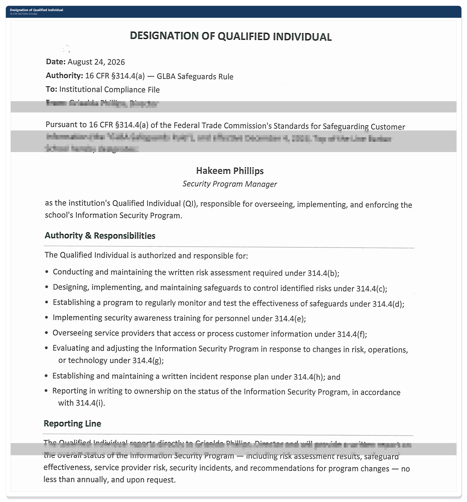

# Governance & Qualified Individual Designation — 16 CFR §314.4(a)

[← Back to README](../README.md)

## Requirement

The GLBA Safeguards Rule requires a covered institution to designate a single **Qualified Individual (QI)** responsible for overseeing, implementing, and enforcing its Information Security Program. The rule requires institutions to clearly establish and document, in writing, accountability for compliance with this part.

## Approach

The institution's ownership issued a short written designation memo that:

- Names the QI by role and formally assigns them responsibility for the Information Security Program
- Details the QI's authority across every other 314.4 element (risk assessment, safeguards, testing, training, service provider oversight, program evaluation, incident response, and board reporting)
- Establishes a direct reporting line from the QI to ownership, including a minimum annual written report

Keeping this as a one-page, signed document (rather than folding it into a longer policy) makes it easy to produce on request during an accreditation or Department of Education review.

## Why this matters

Every other requirement in 314.4 assumes someone is clearly *on the hook* for it. Auditors and accreditors look for this designation first because it establishes who they can hold accountable for everything that follows. It also serves as the anchor citation for GV.RR (Roles, Responsibilities, and Authorities) in the NIST CSF 2.0 crosswalk below.

## Related

- [Risk Assessment Methodology](03-risk-assessment-methodology.md)
