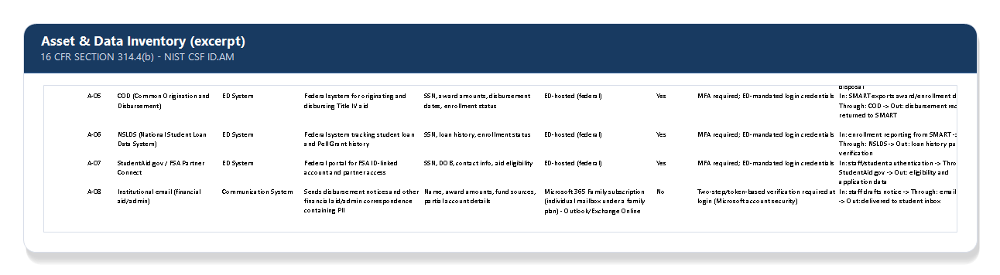

# Asset & Data Inventory — 16 CFR §314.4(b) 

[← Back to README](../README.md)

## Requirement

Before you can assess risk, you have to know what you're protecting. §314.4(b) requires the risk assessment to identify and assess reasonably foreseeable risks to customer information. That starts with knowing where that information lives, moves, and rests. This also aligns with the NIST CSF 2.0 ID.AM (Asset Management) category.

## Approach

Built an inventory of every system that touches student/customer PII, structured around four questions for each one:

| Question | What it captures |
|---|---|
| **What is it?** | System name, vendor, and function (e.g., student information system, financial aid servicing platform, network device) |
| **Where does it live?** | Vendor-hosted / federally hosted / on-premises |
| **What data does it hold or pass through?** | Enrollment records, financial aid data, payment info, etc. |
| **Who's responsible for it?** | Internal owner, or the vendor relationship it falls under |

Systems fall into a few natural buckets:

- **Directly controlled** — on-prem network equipment and staff workstations, where the institution can run its own vulnerability scans and testing directly
- **Vendor-hosted, contracted** — student information system, financial aid servicing/enrollment platforms, loan servicing contact vendors. These are covered instead under [Service Provider Oversight](07-service-provider-oversight.md)
- **Federally hosted** — U.S. Department of Education systems (e.g., COD, NSLDS, StudentAid.gov / FSA Partner Connect). These are out of scope for direct testing, security relies on ED-mandated system requirements
- **State/accreditor-hosted** — state licensing and accreditor portals. They receive the same treatment as federally hosted systems

Mapping data flows helps identify where personally identifiable information (PII) enters the institution, how it moves between systems, where it is stored, and how it exits. This information supports the risk analysis by helping determine the level of risk associated with each system. For example, a system that stores sensitive data, is accessible from the internet, and is managed by an external provider may present a higher risk than a system with limited exposure and direct institutional control.

## Why this matters

You can't secure what you don't know you have, and it's the inventory list everything downstream depends on. The risk register is just this inventory with threats and impact scoring layered on top. Skipping or rushing the inventory produces a risk assessment with gaps nobody notices until an incident finds them.

## Related

- [Risk Assessment Methodology](03-risk-assessment-methodology.md)
- [Service Provider Oversight](07-service-provider-oversight.md)
