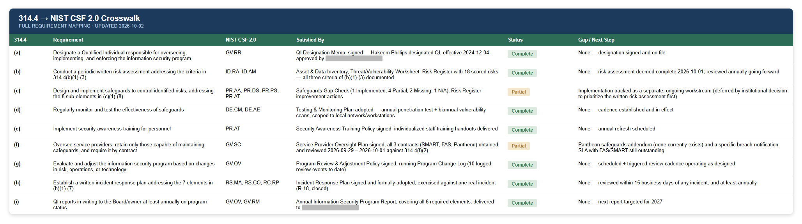
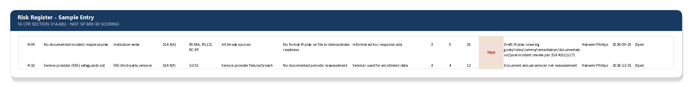

# Risk Assessment Methodology & NIST CSF 2.0 Crosswalk — 16 CFR §314.4(b)

[← Back to README](../README.md)

## Requirement

§314.4(b) requires a **written** risk assessment that identifies reasonably foreseeable internal and external risks to the security, confidentiality, and integrity of customer information, and assesses the sufficiency of safeguards in place to control those risks.

## Why NIST CSF 2.0

The Safeguards Rule does not require institutions to use a specific framework. However, basing the assessment on a recognized standard rather than an informal checklist offers two key benefits. First, it provides documented procedures that reviewers from the Department of Education or accrediting agencies can evaluate. Second, it establishes a consistent and defensible structure for the information security program, connecting all nine requirements into a cohesive approach rather than treating them as separate, unrelated documents.

NIST CSF 2.0's six functions (**Govern, Identify, Protect, Detect, Respond, Recover**) map cleanly onto 314.4's structure:

| 314.4 Element | Requirement | CSF 2.0 Function / Category |
|---|---|---|
| (a) | Designate a Qualified Individual | **GOVERN** — GV.RR (Roles, Responsibilities, Authorities) |
| (b) | Conduct a written risk assessment | **IDENTIFY** — ID.RA (Risk Assessment), ID.AM (Asset Management) |
| (c) | Design & implement safeguards | **PROTECT** — PR.AA, PR.DS, PR.PS, PR.AT |
| (d) | Monitor and test safeguards | **DETECT** — DE.CM (Continuous Monitoring), DE.AE (Adverse Event Analysis) |
| (e) | Train staff | **PROTECT** — PR.AT (Awareness & Training) |
| (f) | Oversee service providers | **GOVERN** — GV.SC (Supply Chain Risk Management) |
| (g) | Evaluate and adjust the program | **GOVERN** — GV.OV (Oversight) |
| (h) | Incident response plan | **RESPOND** — RS.MA, RS.CO; **RECOVER** — RC.RP |
| (i) | QI reports to ownership ≥ annually | **GOVERN** — GV.OV, GV.RM (Risk Management Strategy) |

This crosswalk provides a single reference showing how the institution’s information security program aligns with a recognized cybersecurity framework. It also serves as the foundation for the other documents in this repo, which reference it to maintain consistency across the program.

## Risk Analysis & Scoring

Following NIST SP 800-30's risk assessment process (identify threat sources → identify vulnerabilities → determine likelihood → determine impact → calculate risk), each entry in the risk register scores **Likelihood × Impact** against defined criteria. Impact is tied to concrete outcomes such as number of records potentially exposed, whether a breach-notification trigger would be tripped, and realistic fine exposure. This allows two different people scoring the same risk to land in the same place.

Threat sources considered for each asset include: external attacker, malicious or negligent insider, service-provider failure, and physical loss/theft. They're evaluated against the vulnerabilities identified for that specific system in the [asset inventory](02-asset-data-inventory.md).

Each risk register entry carries:

- A unique ID (e.g., `R-01`, `R-02`, …) referenced by name throughout the other program documents. [Testing & Monitoring](05-testing-monitoring-plan.md), [Incident Response](06-incident-response-plan.md), and [Service Provider Oversight](07-service-provider-oversight.md) all point findings back into this same register instead of keeping separate tracking
- The 314.4 paragraph and CSF category it maps to
- Likelihood, Impact, and resulting risk score/rating
- Current safeguard status, assigned owner, and target remediation date

## Why this matters

A risk register isn't a compliance document you fill out once and file away. It serves as a centralized record that tracks findings from across the information security program, including gaps in safeguards, testing results, incident reviews, and service provider issues. Centralizing this information helps maintain consistency and ensures that all nine requirements of § 314.4 are managed within a unified process rather than across separate, disconnected spreadsheets.

## Related

- [Asset & Data Inventory](02-asset-data-inventory.md)
- [Safeguards Gap Analysis](04-safeguards-gap-analysis.md)
