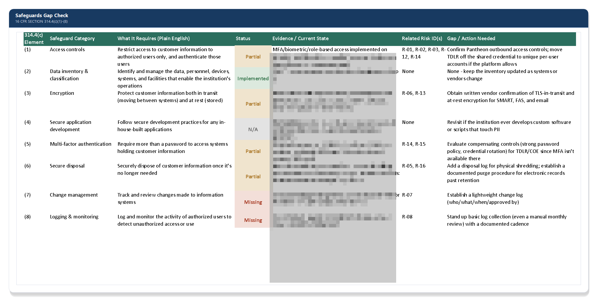

# Safeguards Gap Analysis — 16 CFR §314.4(c)(1)–(8)

[← Back to README](../README.md)

## Requirement

Section 314.4(c) requires the institution to design and implement safeguards to address the risks identified in its risk assessment. This requirement covers eight specific components. Although every component does not need to be fully mature on day one, the institution must accurately document the current status of each component and establish a plan to address any identified gaps.

## Approach

Each of the eight required safeguard categories gets a straightforward status of implemented, partial, or missing:

| # | Safeguard Category | 
|---|---|
| 1 | Access controls |
| 2 | Data inventory & classification |
| 3 | Encryption (at rest and in transit) |
| 4 | Secure application development practices | 
| 5 | Multi-factor authentication | 
| 6 | Secure disposal procedures | 
| 7 | Change management | 
| 8 | Logging & monitoring of authorized user activity | 

Anything short of "Implemented" becomes an entry in the [risk register](03-risk-assessment-methodology.md) with an assigned owner and target date. The gap assessment provides a snapshot of the current implementation status. The risk register is used to track identified gaps, document remediation efforts, and monitor each item through resolution and closure.

## Why this matters

This is deliberately the most exposing document in the whole program. It's a written admission of exactly which safeguards are missing or incomplete and that's exactly why regulators require it. A program that only documents what's already working isn't a risk assessment, it's a highlight reel. An honest gap check, paired with a dated remediation plan in the risk register, is what a real Information Security Program actually looks like.

## Related

- [Risk Assessment Methodology](03-risk-assessment-methodology.md)
- [Testing & Monitoring Plan](05-testing-monitoring-plan.md)
