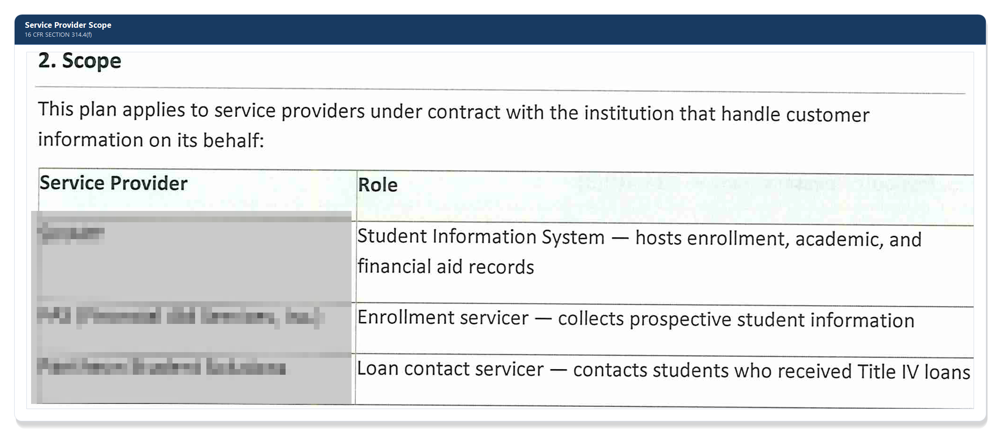
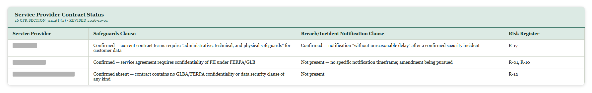

# Service Provider Oversight — 16 CFR §314.4(f)

[← Back to README](../README.md)

## Requirement

§314.4(f) requires the institution to oversee any third-party service provider that receives, maintains, processes, or otherwise accesses customer information on its behalf — by (1) taking reasonable steps to select and retain providers capable of maintaining appropriate safeguards, (2) requiring those safeguards by contract, and (3) periodically reassessing providers based on the risk they present.

## Approach

### Scope

The institution's service provider category applies to any contracted third party that handles customer information on its behalf — for this program that means the student information system vendor, the enrollment/lead-processing servicer, and the loan servicing contact vendor. A regulator, an accreditor, and a mass-market consumer product with no negotiable service agreement are each explicitly called out as *out of scope* for this plan (they're addressed elsewhere — regulators/accreditors aren't "acting on the institution's behalf," and the consumer product is tracked as its own item in the risk register pending a planned migration to a managed business-grade plan). Being explicit about what's *not* in scope, and why, is as important as the list of what is.

### Selecting & retaining providers

Before engaging a new provider, the institution documents a review of available security documentation (e.g., a SOC 2 report or equivalent, where one exists), confirms data handling practices align with applicable federal/state requirements, and considers the provider's known security incident history. For providers already in use before this process existed, that same review is done retroactively as part of the first annual reassessment rather than skipped.

### Requiring safeguards by contract

Each in-scope provider's contract is tracked for whether it contains an adequate safeguards clause, with status logged directly against risk register entries. "Not yet confirmed" was the honest starting status for all three while contracts were being collected; all three have since been obtained and reviewed, with findings — not assumptions — now driving the register:

The outcome was uneven, which is the point of actually reading the contracts instead of assuming they're fine: one provider's current terms require "administrative, technical, and physical safeguards" and include an explicit incident-notification commitment — the strongest language of the three. A second has a general confidentiality clause but no specific breach-notification timeframe. A third was confirmed to have no safeguards clause of any kind, and that same review surfaced a data pathway to downstream federal loan-servicing systems that hadn't been documented before. Each finding produced a different outcome in the risk register — one risk downgraded, one raised — rather than a uniform "contracts reviewed, all clear."

### Periodic reassessment

Every in-scope provider is reassessed **annually on a fixed calendar schedule**, independent of individual contract renewal dates — deliberately decoupled so reassessment doesn't silently slip because a contract auto-renewed. Each reassessment considers whether safeguards remain adequate for the risk the provider presents, any incidents since the last review, and whether the contractual safeguards clause is still current. Findings go into the risk register with an owner, target date, and status, same as everywhere else.

## Why this matters

A service provider that handles customer information on the institution's behalf is effectively an extension of the institution's own attack surface — GLBA holds the institution accountable for that provider's safeguards, not just its own. A fixed reassessment schedule and an explicit, honestly-tracked status (instead of silence, and instead of assuming a contract is fine until proven otherwise) are what keep this from becoming a check-the-box exercise done once at contract signing and never revisited.

## Related

- [Asset & Data Inventory](02-asset-data-inventory.md)
- [Testing & Monitoring Plan](05-testing-monitoring-plan.md)
